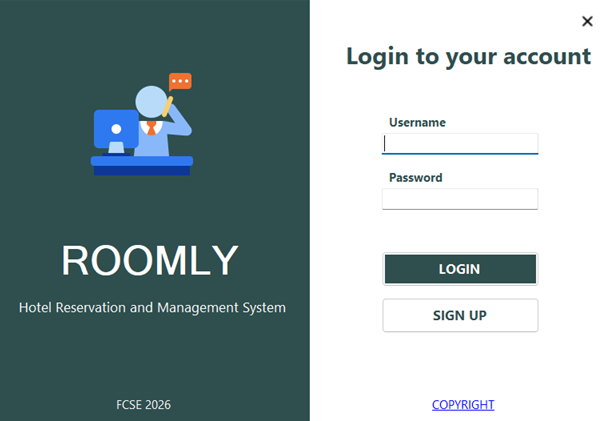
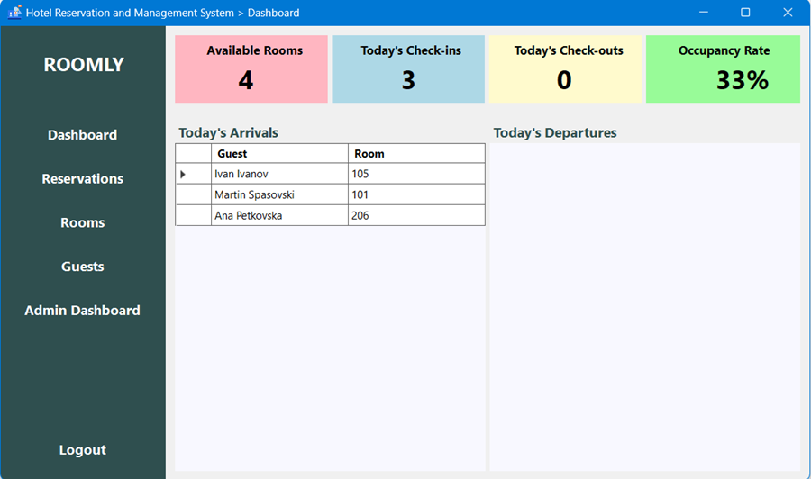
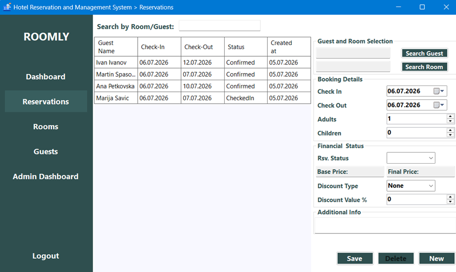
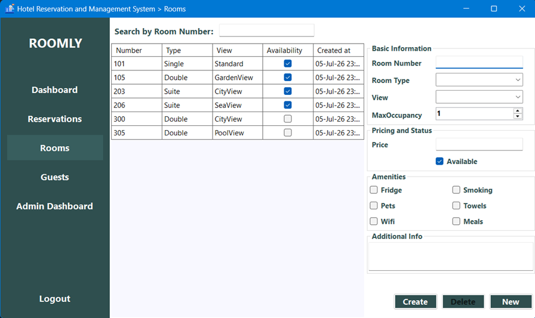
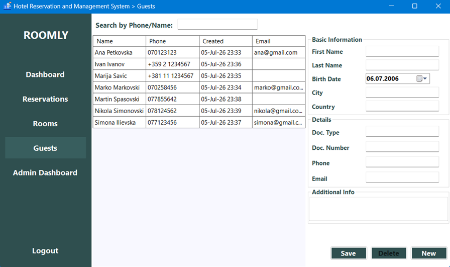
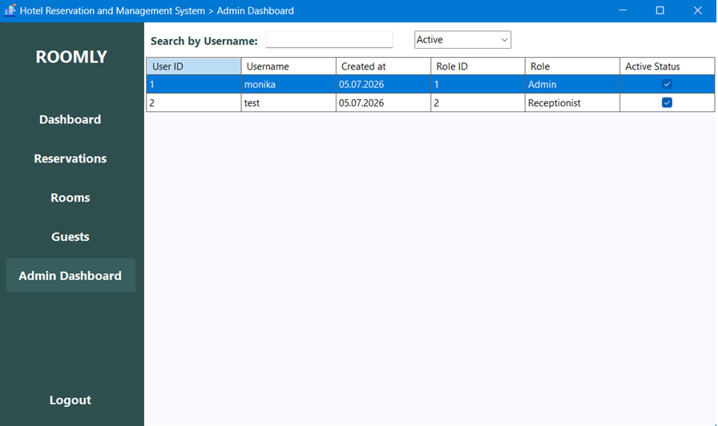

<h1>Документација на проектната задача: Roomly</h1>

<strong>Предмет:</strong> Визуелно програмирање (2025/2026), ФИНКИ

<strong>Проект:</strong> Roomly - Систем за менаџмент на хотелски резервации

<strong>Развоен тим:</strong> Слободан Спасовски (225089), Марио Марковски (225116), Моника Спасовска (186012)

<strong>Ментори:</strong> проф. д-р Дејан Ѓорѓевиќ, м-р Стефан Андонов

<h2>1. Објаснување на проблемот</h2>

<strong>Roomly</strong> е десктоп апликација наменета за автоматизација, дигитализација и оптимизација на секојдневните административни процеси во еден хотел. Главната цел на системот е да им овозможи на вработените брзо, прецизно и едноставно управување со капацитетите на хотелот, елиминирајќи ги ризиците од човечки грешки, како што се дуплирање на резервации или погрешни пресметки.

Основната функционалност на апликацијата вклучува:

<ul>
        <li><strong>Систем за најава и безбедност (RBAC):</strong> Авторизација заснована на две кориснички улоги: <em>Admin</em> (менаџер со целосен пристап до извештаи, активација на профили и системски конфигурации) и <em>Staff</em> (рецепционери со пристап до резервации и гости).</li>
        <li><strong>Преглед на менаџмент табла (Dashboard):</strong> Аналитика во реално време за капацитетот на хотелот: вкупен број на слободни соби, моментално пријавени гости (Check-ins), најавени одјавувања (Check-outs) и процент на вкупна зафатеност за тековниот ден.</li>
        <li><strong>Управување со резервации (CRUD):</strong> Комплетно креирање, пребарување, ажурирање и откажување на резервации со вградена валидација против преклопување на датуми за иста соба.</li>
        <li><strong>Автоматска пресметка на цени:</strong> Динамично калкулирање на вкупната цена врз база на деновите на престој, основната цена на собата и флексибилни попусти (проценттуални или фиксни вредности).</li>
        <li><strong>Регистар на гости и соби:</strong> Водење база на податоци за соби (со детални карактеристики како Wi-Fi, дозволени миленичиња итн.) и база на гости со заштита од дуплирање преку проверка на број на личен документ.</li>
    </ul>

<h2>2. Опис на решението (Податочни структури и класи)</h2>

        Апликацијата е изградена со користење на <strong>.NET Windows Forms</strong> архитектура, каде корисничкиот интерфејс е модуларен и користи сопствени контроли (<code>UserControl</code>) за динамична навигација низ главната форма (<code>MainForm</code>), со што се избегнува отворање на повеќе посебни прозорци.
    

    
Податочниот слој е имплементиран со помош на <strong>Entity Framework (EF) Core</strong>, кој ги мапира релациските податоци од базата во соодветни C# класи (модели). Главните класи и структури вклучуваат:

    <ul>
        <li><code>User</code>: Класа за кориснички сметки со имплементирано лозинка-хаширање преку <code>BCrypt</code> за безбедност и поле за улога (Admin/Staff).</li>
        <li><code>Room</code>: Чува информации за собите (број, тип, спрат, капацитет, цена по ноќ, статус и дополнителни удобности).</li>
        <li><code>Guest</code>: Чува лични податоци за гостите (име, презиме, телефон, е-маил и единствен документ за идентификација).</li>
        <li><code>Reservation</code>: Централна податочна структура која ги поврзува собите со гостите и вработениот кој ја направил резервацијата. Содржи датуми на пријавување/одјавување, статус и логика за крајна наплата.</li>
    </ul>

<h2>3. Опис на карактеристична функција од изворниот код</h2>
    

        Како клучен пример од изворниот код ја издвојуваме логиката за <strong>валидација на достапност на собите</strong> при креирање на нова резервација. Оваа функција спречува конфликти во базата и преклопување на термини.
    

Функција за валидација на достапност:

<pre>
public static bool IsRoomAvailable(int roomId, DateTime checkIn, DateTime checkOut, int excludeReservationId = -1)
{
    using (var context = new AppDbContext())
    {
        return !context.Reservations.Any(r =>
            r.RoomId == roomId &&
            r.Id != excludeReservationId && // Exclude the record we are currently updating
            r.Status != ReservationStatus.Cancelled &&
            r.CheckInDate < checkOut &&
            r.CheckOutDate > checkIn);
    }
}
</pre>

<h2>4.Изглед на апликацијата и упатство за користење</h2>
<h3>4.1. Најава на системот (Login)</h3>

При стартување на апликацијата се појавува прозорец за најава. Вработените внесуваат корисничко име и лозинка. Доколку профилот е нов, администраторот мора претходно да го активира од својот панел.

    

        
    

<h3>4.2. Менаџмент панел</h3>

По успешна најава, се отвара главниот панел каде се прикажуваат статистиките за денот, број на слободни соби, листа и број на гости што треба да се чекираат и од чекираат за тековниот ден, како и процент на зафатеност на собите.

    

        
    

  <h3>4.3. Резервација</h3>
  
Преку менито "Reservations", се отвара форма во која преку помошни pop-up прозорци се избира гостин од базата (или се креира нов) и се бира слободна соба од филтрираната листа по датуми. Попустот автоматски се одзема од финалната сума пред зачувување.

    

        
    

  <h3>4.4. Соби</h3>
  
Менито "Rooms" овозможува преглед и пребарување на хотелските соби преку табеларен приказ на нивните основни информации, како што се бројот, типот, погледот и статусот на достапност. Корисникот може истовремено да внесува или уредува детални податоци за секоја соба, вклучувајќи цени, капацитет и достапни погодности.

    

        
    

  <h3>4.5. Гости</h3>
  
Менито "Guests" овозможува централизирано управување со базата на гости преку пребарување и преглед на нивните основни податоци во табеларен формат. Овој модул овозможува и внесување на детални лични информации, вклучувајќи податоци за идентификациски документи, што е клучно за водење на евиденцијата и спречување на дуплирање на гостите.

    

        
    

  <h3>4.6. Админ панел</h3>
  
Менито "Admin Dashboard" е наменето за административно управување со корисничките сметки и нивните права за пристап во системот. Овој модул овозможува преглед на сите регистрирани вработени, пребарување по корисничко име и активирање или деактивирање на корисничките профили.

    

        
    

<h2>5. Користење на генеративна вештачка интелигенција</h2>

        При развојот на овој проект, генеративната вештачка интелигенција беше користена за оптимизација на кодот, генерирање на структурирани податоци (mock data) за собите во базата и за премин од постари библиотеки кон помодерни решенија.
    

    <ul>
        <li><strong>Модел:</strong> Gemini Pro / ChatGPT (GPT-4o)</li>
        <li><strong>Детален опис на користењето:</strong> Моделот беше искористен за креирање на Entity Framework миграции и генерирање чисти SQL скрипти со цел побрзо полнење на базата со 50+ тест соби со различни карактеристики. Исто така, помогна при рефакторирање на постари .NET класи за серијализација кон современ C# код соодветен за околината.</li>
    </ul>

  
<em>Примери за користени prompts (прашања):</em>

    

        "Write an Entity Framework Core LINQ query to check if a specific hotel room is booked during a given start and end date, taking care not to overlap with cancelled reservations."
    

    

        "Generate a C# seed list for 20 hotel rooms with randomized prices, types (Single, Double, Suite), and Boolean parameters for amenities like Wi-Fi and PetsAllowed."
    

